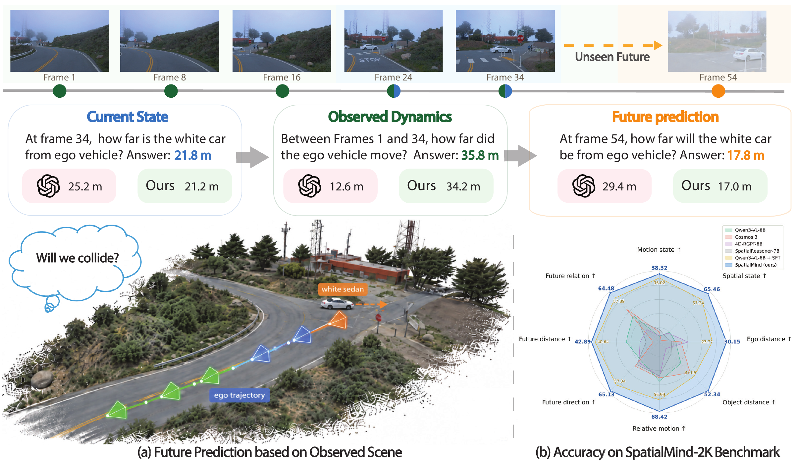
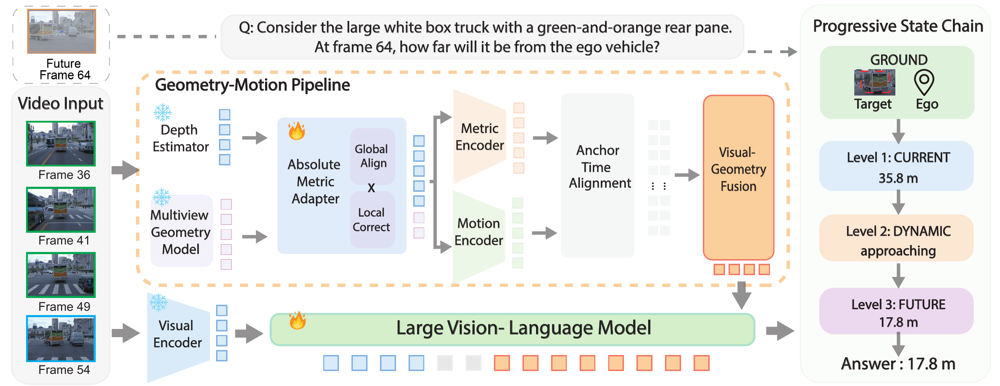
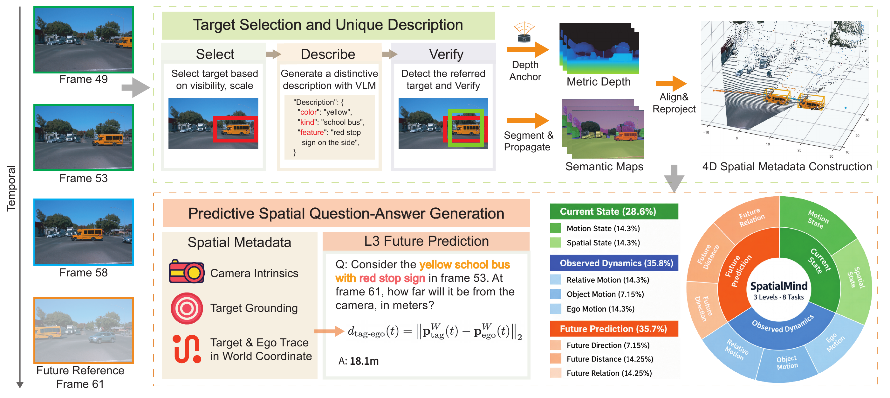

&nbsp;

<div align="center">

<h1>SpatialMind</h1>
<h2>From Sight to Foresight:<br>Predictive Spatial Reasoning in Vision-Language Models</h2>

**Metric-scale spatial reasoning and future prediction from video**

[Feiran Wang](https://openreview.net/profile?id=~Feiran_Wang2)<sup>1,†</sup>,
[Xiaoqi Wang](https://openreview.net/profile?id=~Xiaoqi_Wang2)<sup>2,‡</sup>,
[Ziwei Li](https://openreview.net/profile?id=~Ziwei_Li3)<sup>2</sup>,
[Wenbin He](https://openreview.net/profile?id=~Wenbin_He1)<sup>2</sup>,
[Yan Yan](https://openreview.net/profile?id=~Yan_Yan6)<sup>1</sup>,
[Liu Ren](https://openreview.net/profile?id=~Liu_Ren1)<sup>2</sup>

<sup>1</sup> University of Illinois at Chicago &nbsp;&nbsp; <sup>2</sup> Bosch

<sup>†</sup> This work was done during an internship at Bosch. &nbsp;&nbsp; <sup>‡</sup> Project lead.

[Introduction](#introduction) · [Method](#method) · [Data and Benchmark](#data-and-benchmark) · [Citation](#citation)



</div>

&nbsp;

## Introduction

This is the official repository for **SpatialMind**.

SpatialMind is a metric-scale vision-language model for spatial reasoning and future prediction. Given an observed video prefix and a question, it reasons about distances, motion directions, and spatial relations in both observed and unseen future frames. It grounds this reasoning in current geometry and observed dynamics, connecting what a model sees to what may happen next.

**Key Features:**

- **Metric geometry:** A metric depth adapter combines predicted depth with multiview geometry to anchor spatial reasoning to real-world scale.
- **Progressive state chains:** Structured reasoning grounds the target, establishes its current spatial state, and extends to observed dynamics and future prediction.
- **Eight tasks across three levels:** Current-state understanding, observed-dynamics understanding, and future prediction share a common reasoning framework.
- **Two scene domains:** SpatialMind-30K and SpatialMind-2K cover driving scenes and everyday egocentric activities.

If you find this project useful, please give it a star 🌟 and consider citing our paper!

## Method



SpatialMind refines metric depth through global and local corrections, separately encodes geometry and camera motion, and fuses temporally aligned geometry features into RGB visual tokens. The language model then produces a progressive state chain and the final answer. Future frames are withheld from model inputs.

## Data and Benchmark



The data engine links natural-language entity descriptions to metric geometry through a **Select–Describe–Verify** process. Geometry, semantic propagation, and temporal alignment support automatic generation of questions, reference answers, and state-chain supervision.

- **SpatialMind-30K:** 30,677 training question–answer pairs.
- **SpatialMind-2K:** 2,000 benchmark questions.
- **Source domains:** Waymo driving videos and Ego-Exo4D egocentric videos.

| Level | Focus | Tasks |
| :--- | :--- | :--- |
| **L1** | Current-state understanding | Motion state; spatial state |
| **L2** | Observed-dynamics understanding | Ego-motion distance; target-motion distance; relative motion |
| **L3** | Future prediction | Ego future direction; target future distance; target future relation |

## Release Status

This initial release contains the project overview and paper figures. Code, model checkpoints, and datasets are not yet included in this repository.

---

## Citation

```bibtex
@misc{wang2026spatialmind,
  title={From Sight to Foresight: Predictive Spatial Reasoning in Vision-Language Models},
  author={Wang, Feiran and Wang, Xiaoqi and Li, Ziwei and He, Wenbin and Yan, Yan and Ren, Liu},
  year={2026},
  url={https://github.com/Brack-Wang/spatialmind}
}
```
